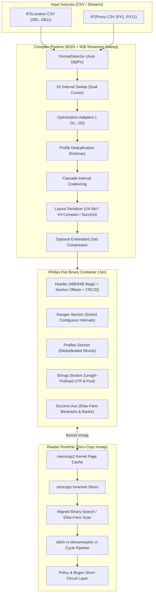

# IPAtlas Architecture Guide

Welcome to the architectural specification for **IPAtlas** — an ultra-fast zero-copy binary GeoIP and Proxy/VPN threat intelligence compiler and reader written in Rust.

---

## 1. System Overview

IPAtlas ingests disjoint Geolocation (IP2Location) and Threat/Proxy datasets (IP2Proxy), aligns them into a non-overlapping contiguous 1D interval topology, normalizes metadata profiles into compact deduplicated dictionaries, and serializes the result into a flat binary table designed for zero-copy memory mapping (`mmap`).



---

## 2. Architectural Layers

The IPAtlas engine is structured into five distinct architectural layers:

```text
ipatlas/
├── models/                         # Foundational domain value objects and binary memory layouts
│   ├── header.rs                   # Database container header (magic, flags, section offsets, CRC32)
│   ├── range.rs                    # 12-byte Standard, 8-byte Compact, and 36-byte IPv6 interval structs
│   ├── profile.rs                  # 32-byte deduplicated metadata profiles and threat bitflags
│   ├── flags.rs                    # Granular threat bitmask (Datacenter, VPN, Tor, Botnet, Spam, Crawlers)
│   └── crc.rs                      # Hardware-accelerated / table CRC32 data integrity verification
├── compiler/                       # Offline data synthesis and transformation engine
│   ├── sweep.rs                    # 1D streaming sweep line algorithm merging disjoint CIDR boundaries
│   ├── adapters.rs                 # Optimization pipeline (-O1 semantic, -O2 string, -O3 lossy coords)
│   ├── format_detector.rs          # Dynamic schema recognition for IP2Location & IP2Proxy CSV columns
│   ├── presets.rs                  # Declarative presets (All, Firewall, Country, Compact)
│   └── succinct.rs                 # Elias-Fano succinct monotone sequence encoder
├── reader/                         # Production sub-microsecond query runtime
│   ├── reader.rs                   # Zero-copy memory-mapped search engine and record resolution
│   ├── succinct.rs                 # Compressed monotone bitvector binary search with select/rank primitives
│   └── decompressor.rs             # Lazy profile decompression for embedded Zstandard databases
├── pipeline/                       # High-performance U-cycle execution pipeline
│   ├── pipeline.rs                 # stitch-rs state machine (Intent -> Context -> Outcome)
│   ├── bogon.rs                    # L1-resident sub-nanosecond RFC1918 / Bogon filter
│   └── policy.rs                   # Security policy enforcement (VPN rejection, datacenter blocking)
└── main.rs                         # CLI frontend (build, inspect, query, benchmark commands)
```

---

## 3. Core Architectural Invariants

### 1. Zero-Copy Kernel Memory Mapping

- Slices of interval records (`[RangeV4]` or `[RangeV4Compact]`) are mapped directly from the operating system's page cache using `memmap2`.
- Memory representations derive `zerocopy` traits (`FromBytes`, `IntoBytes`, `Immutable`, `KnownLayout`). No heap allocations occur during lookup.
- Data structures are 4-byte or 8-byte aligned, completely avoiding unaligned hardware traps.

### 2. 1D Sweep-Line Interval Partitioning

- The IPv4 space ($[0, 2^{32}-1]$) and IPv6 space are represented as sorted, non-overlapping, contiguous intervals.
- The compiler streams IP2Location and IP2Proxy inputs simultaneously with two cursors in $O(N + M)$ time and $O(1)$ intermediate memory.
- Overlapping geo and threat intervals are split at boundaries, creating uniform profile IDs for every sub-range without data loss.

### 3. Profile Deduplication & Normalization

- Repeated metadata tuples (e.g. all IPs belonging to the same City + ASN + Threat combination) resolve to an identical 32-bit `prof_id`.
- The profile table stores compact indices into a contiguous length-prefixed UTF-8 string pool.

### 4. Layout Tiers

1. **`V4-Standard` (12 bytes/interval)**: `from: u32, to: u32, prof_id: u32`. Universal 32-bit profile index capacity.
2. **`V4-Compact` (8 bytes/interval)**: `from: u32, count: u16, prof_id: u16`. Aligns exactly 8 records per 64-byte CPU cache line. Reduces memory footprint by 32.4% while maintaining sub-100ns lookup latency.
3. **`V5-Succinct` (Elias-Fano)**: Monotone prefix bitvector encoding reaching ~100% of the Shannon entropy floor (~17.8 MB active RAM) with bit-level rank/select lookups.

### 5. Monomorphic U-Cycle Pipeline (`stitch-rs`)

- High-level queries pass through a compile-time monomorphic execution pipeline (`stitch-rs`).
- **Descent Phase**: Bogon and private network ranges (RFC 1918, Loopback) short-circuit in $\approx 1.5\text{ ns}$ without accessing the memory-mapped file or DRAM.
- **Ascent Phase**: Threat policies (rejecting proxies, datacenter IPs, or malicious ASNs) execute before returning outcomes to the caller.
