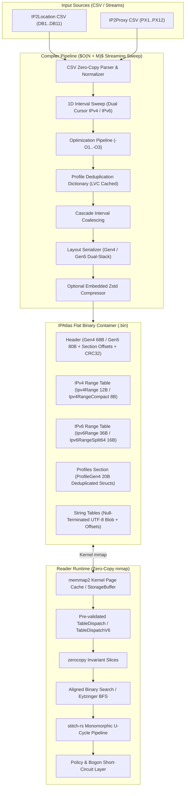

# IPAtlas Architecture Guide

Welcome to the technical architectural specification for **IPAtlas** — an ultra-fast zero-copy binary GeoIP and Proxy/VPN threat intelligence compiler and reader written in Rust.

---

## 1. System Overview

IPAtlas ingests disjoint Geolocation (IP2Location) and Threat/Proxy datasets (IP2Proxy), aligns them into a non-overlapping contiguous 1D interval topology, normalizes metadata profiles into compact deduplicated dictionaries, and serializes the result into a flat binary table designed for zero-copy memory mapping (`mmap`).



---

## 2. Formal Taxonomy Matrix

To eliminate ambiguity across protocol versions and database file format specifications, IPAtlas strictly bifurcates **Container Generations** from **Network Protocols**:

| Category | Identifier | Scope & Definition | Physical Representation / Invariants |
| :--- | :--- | :--- | :--- |
| **Container Generation** | **`Gen4`** (`HeaderGen4`) | Single-stack IPv4 database format. | Header size 68 bytes. Magic `ATLS`, versions `0x0400`–`0x0403`. |
| **Container Generation** | **`Gen5`** (`HeaderGen5`) | Dual-stack IPv4 + IPv6 unified database format. | Header size 80 bytes. Magic `ATLS`, versions `0x0500`–`0x0503`. |
| **Network Protocol** | **`Ipv4`** (32-bit) | IPv4 address space ($[0, 2^{32}-1]$). | Evaluated via `u32`, `Ipv4Addr`. |
| **Network Protocol** | **`Ipv6`** (128-bit) | IPv6 address space ($[0, 2^{128}-1]$). | Evaluated via `u128`, `Ipv6Addr`. |
| **Range Model** | **`Ipv4Range`** | Standard 12-byte contiguous IPv4 interval. | `ip_from: u32, ip_to: u32, profile_id: u32`. Universal 32-bit profile index. |
| **Range Model** | **`Ipv4RangeCompact`** | Compact 8-byte contiguous IPv4 interval. | `ip_from: u32, count: u16, profile_id: u16`. Packs 8 records per 64-byte cache line. |
| **Range Model** | **`Ipv6Range`** | Standard 36-byte packed IPv6 interval. | `ip_from: u128, ip_to: u128, profile_id: u32`. |
| **Range Model** | **`Ipv6RangeSplit64`** | Compact 16-byte IPv6 interval. | `ip_from_hi: u64, count_hi: u32, profile_id: u32`. Zero cache-line straddling. |
| **Metadata Profile** | **`ProfileGen4`** / **`Profile`** | Normalized 20-byte metadata profile. | `city_idx: u32, asn: u32, country: [u8; 2], reg_idx: u16, isp_idx: u16, flags: u16, lat_fixed: i16, lon_fixed: i16`. |

---

## 3. Architectural Layers

The IPAtlas engine is modularized into specialized internal crates and modules:

```text
src/
├── models/                         # Domain value objects, header definitions, and binary layouts
│   ├── header.rs                   # Container headers (HeaderGen4, HeaderGen5, layout & family enums)
│   ├── range.rs                    # Range intervals (Ipv4Range, Ipv4RangeCompact, Ipv6Range, Ipv6RangeSplit64)
│   ├── profile.rs                  # Normalized metadata profiles (ProfileGen4 / Profile)
│   ├── record.rs                   # User-facing query representations (GeoRecord, GeoRecordRef)
│   ├── flags.rs                    # Granular threat bitmask (Datacenter, VPN, Tor, Botnet, Spam, Crawlers)
│   ├── optimization.rs             # Optimization rules, layout configurations, and quantization math
│   ├── presets.rs                  # Declarative presets (All, Firewall, Country)
│   └── crc.rs                      # Hardware-accelerated / table CRC32 data integrity verification
├── compiler/                       # Offline data synthesis, parsing, and serialization engine
│   ├── parser.rs                   # Streaming zero-allocation CSV parsers for DB1..11 and PX1..12
│   ├── sweep.rs                    # Dual-cursor 1D interval sweep line merger (SweepLineMerger, SweepLineMergerV6)
│   ├── adapters.rs                 # Optimization pipeline (-O1 semantic coalescing, -O3 lossy coords, range packers)
│   ├── eytzinger.rs                # Branchless Eytzinger (BFS) array re-ordering and search with prefetch
│   ├── succinct.rs                 # Experimental Elias-Fano succinct monotone sequence bitvector encoder
│   └── writer.rs                   # Atomic atomic binary image serialization and CRC32 calculation
├── reader/                         # Production sub-microsecond query runtime
│   ├── error.rs                    # Centralized ReaderError with exhaustive error variants
│   ├── buffer.rs                   # StorageBuffer unifying mmap kernel pages and heap byte buffers
│   ├── dispatch.rs                 # TableDispatch & TableDispatchV6 pre-validated runtime branchless dispatch
│   ├── strings.rs                  # StringTableRef zero-copy UTF-8 resolution and slice bounds verification
│   └── mmap_reader.rs              # Zero-copy memory-mapped search engine and record resolution API
├── pipeline/                       # High-performance U-cycle execution pipeline
│   ├── pipeline.rs                 # stitch-rs state machine (Intent -> Context -> Outcome)
│   ├── bogon.rs                    # L1-resident sub-nanosecond RFC1918 / Bogon filter
│   └── policy.rs                   # Security policy enforcement (VPN rejection, datacenter blocking)
├── cli/                            # Modular CLI commands and argument definitions
│   ├── args.rs                     # Clap CLI argument structures
│   ├── commands.rs                 # Build, query, inspect, and benchmark workflows
│   ├── convert.rs                  # Offline database AoS <-> SoA repack utility
│   └── bench.rs                    # Benchmark execution harness
└── main.rs                         # Lightweight entrypoint (25 lines)
```

---

## 4. Core Architectural Invariants

### 1. Zero-Copy Kernel Memory Mapping

- Slices of interval records (`[Ipv4Range]`, `[Ipv4RangeCompact]`, `[Ipv6Range]`, `[Ipv6RangeSplit64]`) are mapped directly from the operating system's page cache using `memmap2`.
- Memory representations derive `zerocopy` traits (`FromBytes`, `IntoBytes`, `Immutable`, `KnownLayout`). Zero heap allocations occur on the query hot path.
- All range tables and profile dictionaries are naturally aligned, preventing unaligned hardware traps across x86_64, aarch64, and wasm32.

### 2. 1D Sweep-Line Interval Partitioning

- Both IPv4 ($[0, 2^{32}-1]$) and IPv6 ($[0, 2^{128}-1]$) address spaces are represented as non-overlapping, contiguous intervals.
- The compiler streams IP2Location and IP2Proxy inputs simultaneously with two cursors in $O(N + M)$ time and $O(1)$ intermediate RAM.
- Overlapping geo and threat intervals are sliced at boundaries, establishing uniform profile IDs for every sub-range without data loss.

### 3. Profile Deduplication & Integer Normalization

- Repeated metadata tuples resolve to an identical 32-bit `profile_id`.
- The profile table stores compact indices into a contiguous null-terminated UTF-8 string blob.
- String resolution is strictly lazy: country codes and threat flags are extracted directly from the profile without string lookups.

### 4. Cache-Aligned Storage Tiers

1. **`Ipv4Range` (12 bytes/interval)**: `from: u32, to: u32, profile_id: u32`. Universal 32-bit profile index capacity.
2. **`Ipv4RangeCompact` (8 bytes/interval)**: `from: u32, count: u16, profile_id: u16`. Aligns exactly 8 records per 64-byte CPU cache line (-32.4% RAM).
3. **`Ipv6RangeSplit64` (16 bytes/interval)**: `from_hi: u64, count_hi: u32, profile_id: u32`. Truncates lower 64 bits to eliminate cache-line straddling (4 records per 64B cache line, -55.6% RAM).
4. **`EytzingerSearch` (BFS Array Layout)**: Cache-friendly binary search tree layout with `_mm_prefetch` for predictable latency and elimination of branch mispredictions (**13.5 ns** IPv4 / **16.3 ns** IPv6).
5. **`SuccinctIntervalTable` (Elias-Fano)**: Monotone prefix bitvector encoding reaching ~100% of the Shannon entropy floor (~17.8 MB active RAM).

### 5. Monomorphic U-Cycle Pipeline (`stitch-rs`)

- High-level queries execute through a compile-time monomorphic state machine (`stitch-rs`).
- **Descent Phase**: Bogon and private network ranges (RFC 1918, Loopback) short-circuit in $\approx 1.5\text{ ns}$ without touching disk or DRAM.
- **Ascent Phase**: Threat policies (rejecting proxies, datacenter IPs, or malicious ASNs) execute before returning outcomes to the caller.
